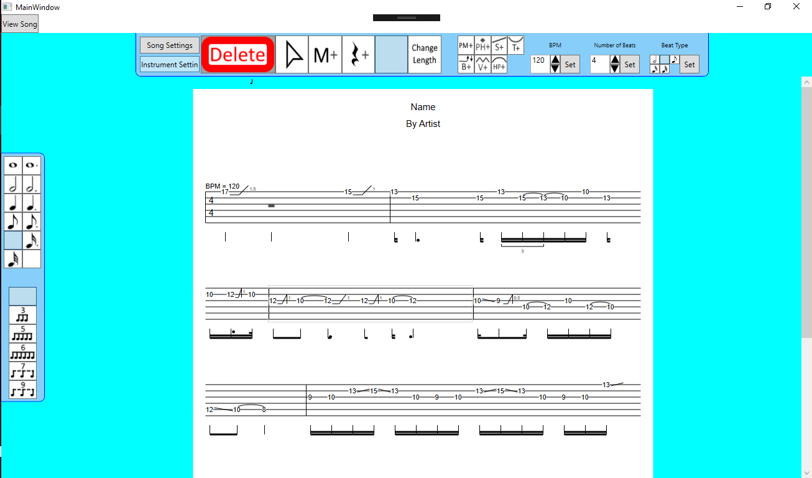
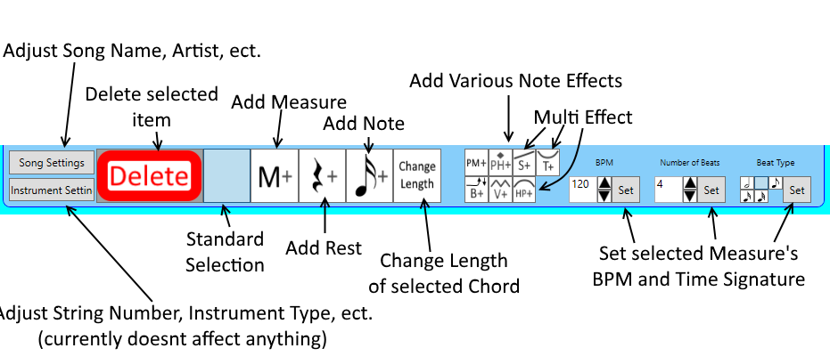
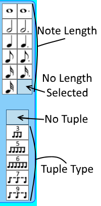
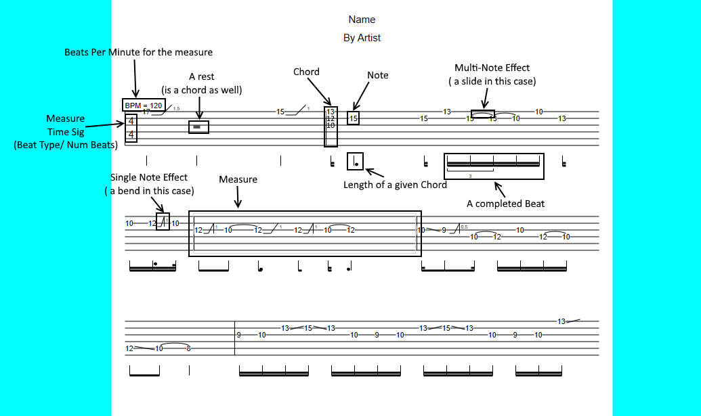

# GuitarTab
This is a C#/ WPF application that allows users to create and edit guitar tablature. THe current version allows the user to perform many editing operations, such as adding/moving/changing notes, adding effects, and changing details such as BPM and Time Signatures. 

This project is currently being integrated with the Guitar Tab REST API contained in another one of my repos.

### Goals
As a guitar player, I have used multiple tablature editors, and as such, creating one of my own was right up my alley. When I began this venture, my focuses were two-fold: to create a genuinely usable and useful product and to advance my knowledge of application development. Thus, I set out to:
- follow common GoF design patterns and follow SOLID principals
- fully implement MVVM by having a completely seperate Model, ViewModel, and View layers.
- focus on refactoring poorly written code

### Future Plans
This project is currently in active development, and as such, is recieving updates and is constantly gaining new features. Currently, I am integrating the GuitarTab REST API into this project. This will add many features, such as creating an account, adding new songs and editing old ones, viewing songs from any user, and rating/reviewing songs. Additionally, users will be able to perform advanced searches with a fully integrated tagging system. On the admin side, this update includes a number of account and song management functions. In the future, I also plan to add:
- a practice functionality, which allows a user to save a practice regimen.
- song playback functionality

## Installation
(Note: the installer is currently not functioning. I will push an update once the final high-level architecture of the API is complete). To install, download the files under "Tablature/Installer". Then, run the "setup" application to launch a standard Windows installer. This installer, when completed, will credate an executable containing all neccisary libraries.

## Tutorial
### Reading Guitar Tablature
While guitar tablature looks like standard sheet music, it slightly varies from its more popular counterpart. A full introduction to the subject can be found at the [Songsterr webstite](https://www.songsterr.com/a/wa/howToReadTab). 

### The GUI

The editing GUI is comprised of three primary areas: the central viewer, the top menu, and the side menu.
#### Top Menu

The top menu contains many of the controls you will use to create the tablature. The "Song Settings" and "Instrument Settings" buttons will open up pop-up menus that will allow the user to change things such as the instruments used or the name/album/artist of the song. The "Standard Selection" through "Change Length" buttons will change the mode the user is in (and the mouse will change symbols to reflect that fact). In order to perform an action, ensure that the mouse is in the desired mode first. Similarily, the set of buttons that add an effect are also a set of toggle-able modes.

##### Side Menu

The side menu contains the note length panel and the tuple panel. These panels, when combined, will determine the length of any added or changed note. Only one length and one tuple amount may be selected at any one time.

### Performing Editing Actions

#### Adding measures, notes, and effects
At a high level, a song is composed of a set of measures, which are denoted as a set of black vertical bars. A measure, in turn, is a set of chords, each of which is a "stack" of notes that are played at the same time. Each note is a single number which represents the fret to play and the string to play it on. notes can then contain effects, which occur before, on, or after a note and can be notated in a number of different ways, as can be seen in the guide to reading tablature above.

##### Adding Measures
To add a measure to the song, select the "Add Measure" mode in the top menu and select a place on the song to put it. Clicking on an already existing measure when placing the new measure will put the new measure in the place of the clicked measure and subsequently move the following measures (including the one clicked on) to after the new measure.

##### Adding Rests
To add a rest, have "Add Rest" selected and click on the song. The rest will be placed as follows:
- If the rest is placed in a measure, it will be added to the measure at the clicked location (if the user clicked on another chord when placing the rest, the rest will be placed first, then the chord and all subsequent chords will be moved to after the new rest)

##### Adding Notes
To add a note, have "Add Note" selected and click anywhere on the song as desired. The note will be placed as follows:
- If the note is placed on top of an already existing one, nothing will happen
- If the note is placed in a chord but not on top of a note, the note will be added to the chord (will become part of the "stack" of notes) on the string clicked.
- If the note is placed in a measure but not on a chord, the note will be placed in a new chord, which will be located in the measure at the clicked location
- If the note is not placed on a measure, a new measure will be created at the end of the song, and the note will be added to a new chord at the beginning of that measure.

(Note: Whenever a new chord is created, whether by placing a rest or a note on a new stack, the addition will only be allowed if the measure has enough available space to hold the new chord. Additionally, whenever a chord is added between existing chords, it will break all multi-effects between the existing chords)

##### Adding Effects
To add an effect to a note, have one of the Note Effect toggles selected, and then select the desired note. If the effect is a multi-effect (meaning it dictates a technique to user when transitioning between notes), a message will display that prompts the user to select a note in an adjacent chord to connect to. Select the second note and the effect will be added. 

Effects come in two varieties (single and multi) and three positions (before, strike, and after). The former indicates whether the effect acts as a transition between two notes or is only placed on a single note, and the latter indicates whether the effect occurs before the note it is on is played, when the note is played, or after the note is played. As a multi-effect ties together stwo notes, it is an after effect for the first note and a before effect for the second. The following effects are available:
- Bend (after)
- Vibrato (after)
- Pinch Harmonic (strike)
- Palm Mute (strike)
- Tie (multi effect, the two notes it is placed on must be adjacent, on the same string, and have the same fret)
- Slide (multi effect, its two notes must be adjacent and on the same string)
- Hammer On/Pull Off (multi effect, its two notes must be adjacent, on the same string, and have different frets)

#### Deleting measures, notes, and chords
In order to delete any object, from note to measure, first have that item selected (a dark grey border will indicate which item is selected). Then, simply press the "Delete" button and the item will be removed.

To remove an effect from a note, it is not possible to select the effect and then hit "Delete". Instead, double click on the connected note to launch the note property mehu and then use the appropriate effect dropdown, changing it to "No Effect". For a multi-effect, either note can be used to remove the effect.

#### Moving measures, notes, and chords
To move any object, first have that object selected. Then mouse down on the selected object and drag it to the desired location. For notes, the note will also be dragged to the string closest to the mouse. Additionally, if a note in a chord is dragged and dropped to a location outside of the chord, a new chord will be created (if possible) with the same length as the old chord.

#### Changing measure, note, and chord properties
Each type of object (measure, chord, and note) has its own pop-up property menu allowing the user to change the following values:
- Measure: beats per minute, beat type, number of beats
- Chord: length
- Note: string, fret, and effects (has a slot for an effect before the note is played, when the note is payed, and after the snote is played)
- Bend: Bend amount, whether the bend returns
- Slide: if the slide is played legato
- Vibrato: if the vibrato is a wide vibrato

In order to gain access to these menus, double-click the desired item on the tab. For effects, the property menu will be displayed under the appropriate drop-donw in the effect section of the note's property menu.

### Creating, Uploading, Updating, and Searching for Songs
Coming soon
### Account Management
coming soon
